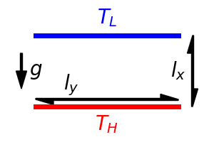

.. _governing_equations:

#########
Equations
#########

****************
Dimensional form
****************

In this project, we consider the conservation laws of the mass, the momentum, and the internal energy, which are governed by

.. math::

    \pder{\tilde{u}_i}{\tilde{x}_i}
    =
    0,

.. math::

    \pder{\tilde{u}_i}{\tilde{t}}
    +
    \tilde{u}_j \pder{\tilde{u}_i}{\tilde{x}_j}
    =
    -
    \frac{1}{\tilde{\rho}} \pder{\tilde{p}}{\tilde{x}_i}
    +
    \tilde{\nu} \pder{}{\tilde{x}_j} \pder{\tilde{u}_i}{\tilde{x}_j}
    +
    \tilde{g}_i,

.. math::

    \pder{\tilde{T}}{\tilde{t}}
    +
    \tilde{u}_j \pder{\tilde{T}}{\tilde{x}_j}
    =
    \tilde{\kappa} \pder{}{\tilde{x}_j} \pder{\tilde{T}}{\tilde{x}_j},

respectively, where the summation rule is applied.

.. note::

    * :math:`\tilde{q}` implies that the quantity :math:`q` is dimensional (i.e., before normalised).

    * We assume the physical properties (e.g., the density :math:`\tilde{\rho}`, the dynamic and kinematic viscosities :math:`\tilde{\mu}, \tilde{\nu}`, the thermal diffusivity :math:`\tilde{\kappa}`) to be constant.

********************
Non-dimensional form
********************

In this project, we focus on `Rayleigh-Bénard convection <https://en.wikipedia.org/wiki/Rayleigh–Bénard_convection>`_, which is an excellent model problem to shed light on the conservation properties.
By adopting `Boussinesq approximation <https://en.wikipedia.org/wiki/Boussinesq_approximation_(buoyancy)>`_ and normalise the equations with proper scales, we obtain the following non-dimensional equations which play the central role in this project.

.. _eq_mass:

.. math::

    \pder{u_i}{x_i}
    =
    0.

.. _eq_momentum:

.. math::

    \pder{u_i}{t}
    +
    u_j \pder{u_i}{x_j}
    =
    -
    \pder{p}{x_i}
    +
    \frac{\sqrt{Pr}}{\sqrt{Ra}} \pder{}{x_j} \pder{u_i}{x_j}
    +
    T \delta_{ix}.

.. _eq_temperature:

.. math::

    \pder{T}{t}
    +
    u_j \pder{T}{x_j}
    =
    \frac{1}{\sqrt{Pr} \sqrt{Ra}} \pder{}{x_j} \pder{T}{x_j}.

Here Rayleigh number :math:`Ra` and Prandtl number :math:`Pr` are dimensionless parameters given by

.. math::

    Ra & = \frac{\tilde{\beta} \tilde{g} {\tilde{l_x}}^3 \left( \Delta \tilde{T} \right)}{\tilde{\nu} \tilde{\kappa}}, \\
    Pr & = \frac{\tilde{\nu}}{\tilde{\kappa}},

where :math:`\tilde{\beta}`, :math:`\tilde{g}`, :math:`\tilde{l_x}`, and :math:`\Delta \tilde{T} = \tilde{T}_{H} - \tilde{T}_{L}` are the thermal expansion coefficient :math:`\left[ K^{-1} \right]`, the gravitational acceleration :math:`\left[ L T^{-2} \right]`, the distance between the walls :math:`\left[ L \right]`, and the temperature difference :math:`\left[ K \right]`, respectively.

Also, by taking the inner product of the momentum balance and the velocity vector, a relation with respect to the squared velocity is obtained:

.. _eq_squared_velocity:

.. math::

    \pder{k}{t}
    +
    u_j \pder{k}{x_j}
    =
    -
    u_j \pder{p}{x_j}
    +
    \frac{\sqrt{Pr}}{\sqrt{Ra}} \pder{}{x_j} \left( u_i \pder{u_i}{x_j} \right)
    -
    \frac{\sqrt{Pr}}{\sqrt{Ra}} \pder{u_i}{x_j} \pder{u_i}{x_j}
    +
    u_i T \delta_{ix},

where

.. math::

    \tilde{k}
    \equiv
    \frac{1}{2}
    \tilde{u}_i \tilde{u}_i.

Similarly, by multiplying the temperature with the internal energy balance, we obtain the relation with respect to the squared temperature:

.. _eq_squared_temperature:

.. math::

    \pder{h}{t}
    +
    u_j \pder{h}{x_j}
    =
    \frac{1}{\sqrt{Pr} \sqrt{Ra}} \pder{}{x_j} \left( T \pder{T}{x_j} \right)
    -
    \frac{1}{\sqrt{Pr} \sqrt{Ra}} \pder{T}{x_j} \pder{T}{x_j},

where

.. math::

    \tilde{h}
    \equiv
    \frac{1}{2}
    \tilde{T} \tilde{T}.

Periodic boundary conditions are imposed in the homogeneous directions :math:`y` and :math:`z`.
The boundary conditions in the :math:`x` (wall-normal) direction are listed here:

* :math:`\ux = 0`: Dirichlet condition, impermeable walls.

* :math:`\uy = \uz = 0`: Dirichlet condition, no-slip and stationary walls.

* :math:`\partial p / \partial x = 0`: Neumann condition.

* :math:`\vat{T}{x = 0}, \vat{T}{x = l_x \equiv 1}`: Dirichlet condition, fixed temperature satisfying :math:`\vat{T}{x = 0} - \vat{T}{x = 1} = 1`.

.. note::

    * Without loss of generality, :math:`\tilde{\beta}`, :math:`\tilde{g}`, :math:`\tilde{l_x}`, and :math:`\Delta \tilde{T}` are fixed to unity.

    * The reference velocity scale :math:`\tilde{U} \left[ L T^{-1} \right]` is defined by the other parameters :math:`\tilde{U} = \sqrt{\tilde{\beta} \tilde{g} \tilde{l_x} \left( \Delta \tilde{T} \right)} \left( = 1 \right)`, which is often called as the free-fall velocity.

.. _continuous_quadratic_quantities:

********************
Quadratic Quantities
********************

We investigate the properties of the mentioned relations with respect to the quadratic quantities :math:`k` and :math:`h`.
In particular, we focus on how the net amount of them:

.. math::

    &
    \int
    \int
    \int
    k
    dx
    dy
    dz,

    &
    \int
    \int
    \int
    h
    dx
    dy
    dz,

behave, which follow

.. math::

    &
    \int
    \int
    \int
    \pder{k}{t}
    dx
    dy
    dz
    =
    \int
    \int
    \int
    \left\{
        -
        u_j \pder{k}{x_j}
        -
        u_i \pder{p}{x_i}
        +
        \frac{\sqrt{Pr}}{\sqrt{Ra}} \pder{}{x_j} \left( u_i \pder{u_i}{x_j} \right)
        -
        \frac{\sqrt{Pr}}{\sqrt{Ra}} \pder{u_i}{x_j} \pder{u_i}{x_j}
        +
        u_i T \delta_{ix}
    \right\}
    dx
    dy
    dz,

    &
    \int
    \int
    \int
    \pder{h}{t}
    dx
    dy
    dz
    =
    \int
    \int
    \int
    \left\{
        -
        u_j \pder{h}{x_j}
        +
        \frac{1}{\sqrt{Pr} \sqrt{Ra}} \pder{}{x_j} \left( T \pder{T}{x_j} \right)
        -
        \frac{1}{\sqrt{Pr} \sqrt{Ra}} \pder{T}{x_j} \pder{T}{x_j}
    \right\}
    dx
    dy
    dz,

giving

.. _quadratic_quantity_balance:

.. math::

    &
    \int
    \int
    \int
    \pder{k}{t}
    dx
    dy
    dz
    =
    \int
    \int
    \int
    u_x T
    dx
    dy
    dz
    -
    \int
    \int
    \int
    \frac{\sqrt{Pr}}{\sqrt{Ra}} \pder{u_i}{x_j} \pder{u_i}{x_j}
    dx
    dy
    dz,

    &
    \int
    \int
    \int
    \pder{h}{t}
    dx
    dy
    dz
    =
    \vat{
        T
    }{x = 1}
    \int
    \int
    \frac{1}{\sqrt{Pr} \sqrt{Ra}}
    \vat{
        \pder{T}{x}
    }{x = 1}
    dy
    dz
    -
    \vat{
        T
    }{x = 0}
    \int
    \int
    \frac{1}{\sqrt{Pr} \sqrt{Ra}}
    \vat{
        \pder{T}{x}
    }{x = 0}
    dy
    dz
    -
    \int
    \int
    \int
    \frac{1}{\sqrt{Pr} \sqrt{Ra}} \pder{T}{x_j} \pder{T}{x_j}
    dx
    dy
    dz.

In this project, we aim at faithfully replicating these relations from a numerical standpoint.

Derivation is given below, focusing on the individual components.

===============
Advective terms
===============

We have

.. math::

    -
    \int
    \int
    \int
    u_j \pder{k}{x_j}
    dx
    dy
    dz
    =
    -
    \int
    \int
    \int
    \left(
        \pder{u_j k}{x_j}
        -
        k
        \pder{u_j}{x_j}
    \right)
    dx
    dy
    dz,

which is, due to the incompressibility:

.. math::

    -
    \int
    \int
    \int
    \pder{u_j k}{x_j}
    dx
    dy
    dz
    =
    -
    \int
    \int
    \vat{
        \left(
            u_x k
        \right)
    }{x = 1}
    dy
    dz
    +
    \int
    \int
    \vat{
        \left(
            u_x k
        \right)
    }{x = 0}
    dy
    dz,

where the divergence theorem and the periodic boundary conditions are utilized.
Since the walls are impermeable, :math:`u_x \equiv 0` on the walls and thus this leads to 0, indicating that the advective terms do not affect the total amount of :math:`k`.

Note that exactly the same statement holds for the advective terms of :math:`h`.

=======================
Pressure-gradient terms
=======================

We consider

.. math::

    -
    \int
    \int
    \int
    u_i \pder{p}{x_i}
    dx
    dy
    dz.

By following the identical algebra we adopted to investigate the advective terms, we find that the pressure-gradient terms do not affect the net amount of :math:`k` either.

============================
Diffusive terms - conduction
============================

We have

.. math::

    \int
    \int
    \int
    \frac{\sqrt{Pr}}{\sqrt{Ra}}
    \pder{}{x_j}
    \left(
        u_i
        \pder{u_i}{x_j}
    \right)
    dx
    dy
    dz.

By utilizing the divergence theorem, this leads to

.. math::

    \int
    \int
    \frac{\sqrt{Pr}}{\sqrt{Ra}}
    \vat{
        \left(
            u_i
            \pder{u_i}{x}
        \right)
    }{x = 1}
    dy
    dz
    -
    \int
    \int
    \frac{\sqrt{Pr}}{\sqrt{Ra}}
    \vat{
        \left(
            u_i
            \pder{u_i}{x}
        \right)
    }{x = 0}
    dy
    dz,

where periodic boundary conditions are assumed in the :math:`y` and :math:`z` directions.
Since we assume that the walls are impermeable and fixed (i.e., :math:`u_i \equiv 0_i` on the walls), the integrands are all zero for all directions, indicating that the conductive terms do not alter the total amount of :math:`k`.

Regarding the conductive terms with respect to :math:`h`, we also have an analogous relation:

.. math::

    \int
    \int
    \frac{1}{\sqrt{Pr} \sqrt{Ra}}
    \vat{
        \left(
            T
            \pder{T}{x}
        \right)
    }{x = 1}
    dy
    dz
    -
    \int
    \int
    \frac{1}{\sqrt{Pr} \sqrt{Ra}}
    \vat{
        \left(
            T
            \pder{T}{x}
        \right)
    }{x = 0}
    dy
    dz.

Since they are non-zero in general, we find that the conduction plays a role in the budget of :math:`h`.

=============================
Diffusive terms - dissipation
=============================

We have

.. math::

    -
    \int
    \int
    \int
    \frac{\sqrt{Pr}}{\sqrt{Ra}} \pder{u_i}{x_j} \pder{u_i}{x_j}
    dx
    dy
    dz

and

.. math::

    -
    \int
    \int
    \int
    \frac{1}{\sqrt{Pr} \sqrt{Ra}} \pder{T}{x_j} \pder{T}{x_j}
    dx
    dy
    dz,

which are always non-positive and dissipate :math:`k` and :math:`h`.

===============
Body force term
===============

We have

.. math::

    \int
    \int
    \int
    u_x
    T
    dx
    dy
    dz,

which works as a source term and alters the net amount of :math:`k`.

