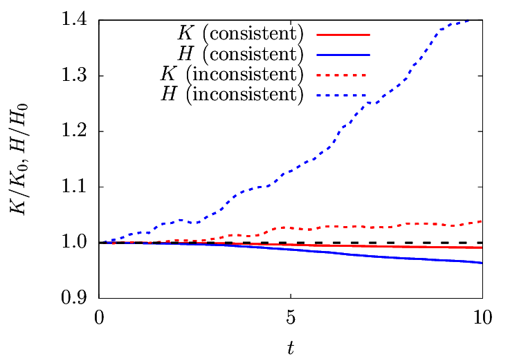
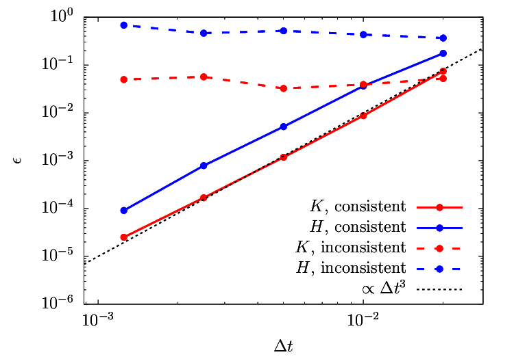

.. include:: /references.txt

#####################################
Linearly-interpolated advective terms
#####################################

*******
Summary
*******

Advective terms do not only transfer the transported quantity but also increase or decrease it, which breaks physics and tends to destabilise the solver.
This artificial error stays even a very small time step :math:`\Delta t` is adopted.

*******
Details
*******

When I interpolate a quantity from the neighbouring two points, linear interpolations generally give the most accurate results.

Here, instead of the energy-conserving scheme derived before, I use the following discrete governing equations:

.. math::

   \der{\ux}{t}
   +
   \dder{
      \dintrpa{\ux}{x}
      \dintrpa{\ux}{x}
   }{x}
   +
   \dder{
      \color{red}{\dintrpv{\uy}{x}}
      \dintrpa{\ux}{y}
   }{y}
   =
   -\dder{p}{x}
   +
   \frac{\sqrt{Pr}}{\sqrt{Ra}} \left\{
      \dder{}{x} \left( \dder{\ux}{x} \right)
      +
      \dder{}{y} \left( \dder{\ux}{y} \right)
   \right\}
   +
   \color{red}{\dintrpa{T}{x}},

.. math::

   \der{\uy}{t}
   +
   \dder{
      \dintrpa{\ux}{y}
      \color{red}{\dintrpa{\uy}{x}}
   }{x}
   +
   \dder{
      \dintrpa{\uy}{y}
      \dintrpa{\uy}{y}
   }{y}
   =
   -\dder{p}{y}
   +
   \frac{\sqrt{Pr}}{\sqrt{Ra}} \left\{
      \dder{}{x} \left( \dder{\uy}{x} \right)
      +
      \dder{}{y} \left( \dder{\uy}{y} \right)
   \right\},

.. math::

   \der{T}{t}
   +
   \dder{
      \ux
      \color{red}{\dintrpa{T}{x}}
   }{x}
   +
   \dder{
      \uy
      \dintrpa{T}{y}
   }{y}
   =
   \frac{1}{\sqrt{Pr} \sqrt{Ra}} \left\{
      \dder{}{x} \left( \dder{T}{x} \right)
      +
      \dder{}{y} \left( \dder{T}{y} \right)
   \right\},

where the reddish terms, which are originally arithmetically- or volumetrically-interpolated, are replaced by the linear interpolations.

The velocity and the temperature fields are randomly disturbed initially, and the time step size is fixed to :math:`\Delta t = 10^{-2}`.

I monitor the changes in the volume-integrated quadratic quantities :math:`K` and :math:`H` for two types of schemes:

One might be tempted to investigate the effects of the time step size :math:`\Delta t`.
To check the dependence, I vary the time step size :math:`\Delta t` to see the convergence:

.. math::

   \epsilon_{k} \equiv \left| \frac{K_{t = 10}- K_0}{K_0} \right|, \\
   \epsilon_{h} \equiv \left| \frac{H_{t = 10}- H_0}{H_0} \right|.

The results are shown here:

I notice that the energy-conserving scheme shows third-order convergence, which is consistent with the previous reports (see e.g. |MORINISHI1998|, |HAM2002| and |COPPOLA2019|).
In short, the decrease is because of the temporal integration since the explicit Runge-Kutta schemes tend to dissipate them.
Note that the total energies are always reduced when the energy-conserving scheme is adopted, which is a favourable feature from a stability point of view.

With the linear interpolations, on the other hand, the errors never shrink if the time step size is very small, indicating that make :math:`\Delta t` smaller does not help to stabilise the solver.
In addition, the total energies are generally increased and may lead to the divergence of the solver.

In the normal cases, the results are not affected so much because of the viscous dissipation, which generally works to stabilise the fields.
For highly-turbulent wall-bounded flows with largely stretched grid, however, using an energy-consistent scheme could be useful to obtain more reliable and stable solutions.

