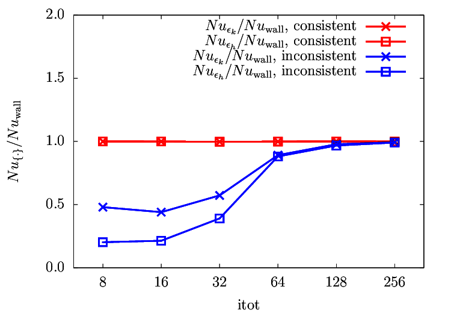

.. include:: /references.txt

#################
Dissipation rates
#################

*******
Summary
*******

Intuitive ways to compute the dissipation rates are compared with the consistent ways.
Inconsistent schemes tend to underestimate the dissipations, and as a result the perfect Nusselt number agreements are broken.

*******
Details
*******

I consider

.. math::

   \der{u_i}{x_j} \der{u_i}{x_j}
   = \left( \der{\ux}{x} \right)^2
   + \left( \der{\ux}{y} \right)^2
   + \left( \der{\uy}{x} \right)^2
   + \left( \der{\uy}{y} \right)^2,

which is necessary to compute the kinetic dissipation rate :math:`\epsilon_{k}`.

A more intuitive way to compute :math:`\der{\ux}{y}` at the cell center might be

.. math::

   \vat{\frac{\delta u_x}{\delta y}}{i,j}
   =
   \frac{1}{2} \left(
      \frac{\vat{\ux}{\pim,\pjpp} - \vat{\ux}{\pim,\pjmm}}{2 \Delta y}
      +
      \frac{\vat{\ux}{\pip,\pjpp} - \vat{\ux}{\pip,\pjmm}}{2 \Delta y}
   \right).

Similarly, the discretisation of :math:`\der{T}{y}`, which is essential to compute the thermal dissipation rate

.. math::

   \der{T}{x_i} \der{T}{x_i}
   = \left( \der{T}{x} \right)^2
   + \left( \der{T}{y} \right)^2,

could be given as

.. math::
   \vat{\frac{\delta T}{\delta y}}{i,j}
   =
   \frac{
      \vat{T}{\pic,\pjpp}
    - \vat{T}{\pic,\pjmm}
   }{2 \Delta y}.

.. seealso::

   A consistent scheme is given :ref:`here <derivation_momentum_diffusive_terms>` and :ref:`here <derivation_internal_diffusive_terms>`.

Here, I compare this inconsistent discretisations with the consistent ones.

My interest is :math:`Nu_{\epsilon_{k}}` and :math:`Nu_{\epsilon_{h}}`, which are the Nusselt numbers computed based on the kinetic and the thermal dissipation rates, respectively.
The resolution is varied to see the effects:

Note that :math:`Nu` are shown after normalised by the reference value :math:`Nu_{wall}`, and thus they should be unity.

I find that the ratios indeed give unity when I evaluate the dissipation rates in the consistent ways, which is irrespective to the resolution.
Note that, although :math:`Nu` is a function of the spatial resolution (of course), the agreement of the different :math:`Nu` definitions is always satisfied.

When the inconsistent schemes are adopted, on the other hand, :math:`Nu_{\epsilon_{k}}` and :math:`Nu_{\epsilon_{h}}` do not agree to the reference value.
Generally they give lower values and underestimate the Nusselt number.
Obviously the exact energy balance derived in :ref:`the Nusselt number relations <nusselt_number_relations>` are violated.

