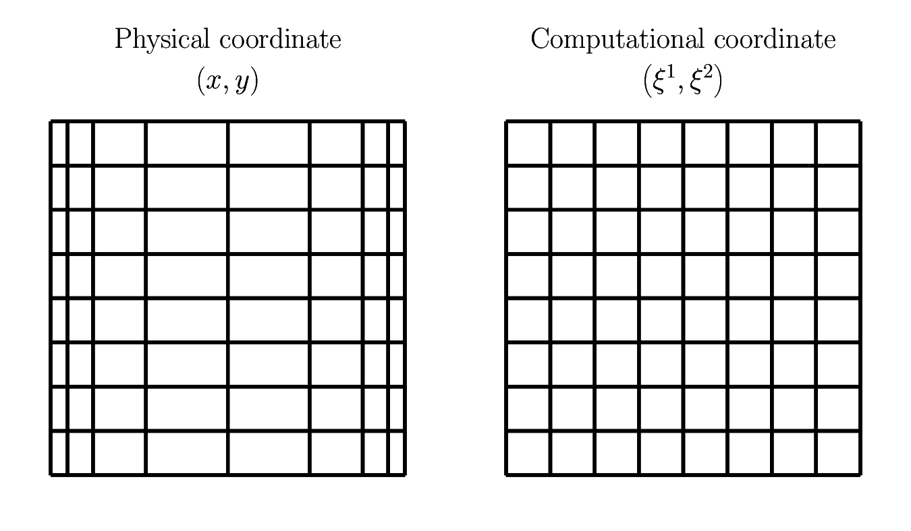

.. _strong_conservation_form:

.. include:: /references.txt

#####################################
Equations in Strong Conservation Form
#####################################

As explained in :ref:`the domain setup <domain_setup>`, non-uniform grid spacings are adopted in the wall-normal direction to resolve boundary layers.
This makes interpolations of quantities ambiguous, as linear interpolations, arithmetic averages, and volumetric averages all yield different results.
As |HAM2002| pointed out, to obtain discrete advective terms that are energy-conserving, we need to utilize the volumetric averages to average some quantities, while arithmetic averages should be used for others, which is cumbersome and error-prone to implement.
To mitigate this issue, we perform a coordinate transform from the original coordinate (physical coordinate) to a new coordinate (computational coordinate):

Since the cell-face distances are always unity in the new coordinate system, arithmetic averages suffice for all interpolations.
This is a versatile approach and is applicable to `the other coordinate systems as well <https://github.com/NaokiHori/SimpleTCSolver>`_.

Note, however, that the new coordinate system has different basis vectors compared to the original system.
The wall-normal basis vectors in the physical coordinate system are :math:`\basis{1}` with a unique length everywhere, while :math:`\gbasis{1}` varies in size.
We need to take this kind of *stretching* of the coordinates into account.
To this end, we write down the governing equations in a more general way, incorporating the spatial changes in the basis vectors (strong conservation form for rectilinear coordinates), giving the following relations:

.. math::

    \frac{1}{J}
    \pder{}{\gcs{j}}
    \left(
        J
        \gvel{j}
    \right)
    =
    0,

.. math::

    \gbasis{i}
    \left[
        \pder{\gvel{i}}{t}
        +
        \frac{\gvel{j}}{\sfact{i}}
        \pder{}{\gcs{j}}
        \left(
            \sfact{i}
            \gvel{i}
        \right)
        +
        \frac{1}{\sfact{i}}
        \frac{1}{\sfact{i}}
        \pder{p}{\gcs{i}}
        -
        \frac{\sqrt{Pr}}{\sqrt{Ra}}
        \frac{1}{\sfact{i}}
        \frac{1}{J}
        \pder{}{\gcs{j}}
        \left\{
            \frac{J}{\sfact{j}}
            \frac{1}{\sfact{j}}
            \pder{}{\gcs{j}}
            \left(
                \sfact{i}
                \gvel{i}
            \right)
        \right\}
        -
        \frac{T}{\sfact{1}}
        \delta_{i1}
    \right]
    =
    0_i,

.. math::

    \pder{T}{t}
    +
    \gvel{j}
    \pder{T}{\gcs{j}}
    -
    \frac{1}{\sqrt{Pr} \sqrt{Ra}}
    \frac{1}{J}
    \pder{}{\gcs{j}}
    \left(
        \frac{J}{\sfact{j}}
        \frac{1}{\sfact{j}}
        \pder{T}{\gcs{j}}
    \right)
    =
    0.

:math:`\gvel{i}` are the contra-variant components of the velocity vector with co-variant basis vectors, i.e.,

.. math::

    \vec{u}
    \equiv
    \basis{i} u_i
    \equiv
    \gbasis{i} \gvel{i}.

The basis vectors and the components of the two coordinate systems are related by

.. math::

    \basis{i}
    &
    =
    \pder{\gcs{j}}{x_i}
    \gbasis{j},

    u_i
    &
    =
    \pder{x_i}{\gcs{j}}
    \gvel{j},

or for rectilinear coordinates simply

.. math::

    \basis{i}
    &
    =
    \pder{\gcs{i}}{x_i}
    \gbasis{i}
    \equiv
    \frac{1}{\sfact{i}}
    \gbasis{i}
    \,\,
    (\text{no summation rule over}\,i),

    u_i
    &
    =
    \pder{x_i}{\gcs{i}}
    \gvel{i}
    \equiv
    \sfact{i}
    \gvel{i}
    \,\,
    (\text{no summation rule over}\,i),

where :math:`\sfact{i}` is the scale factor.
Since we design the computational coordinate systems such that the grid sizes are unitary, the scale factors are given by the grid sizes in the physical coordinates:

.. math::

    \sfact{1}
    &
    \equiv
    \Delta x,

    \sfact{2}
    &
    \equiv
    \Delta y,

    \sfact{3}
    &
    \equiv
    \Delta z,

which are implemented in the code as follows.

Note that, since the wall-normal grid sizes may differ, the wall-normal scale factors :math:`\sfact{1}` are stored at every wall-normal cell face and center.
At the faces, we calculate them using the cell-center distance

.. math::

    \vat{\sfact{1}}{\cmidx{i}}
    =
    \vat{x}{i}
    -
    \vat{x}{i-1}:

.. myliteralinclude:: /../../src/domain.c
    :language: c
    :tag: x scale factors at x cell faces

At the centers, we calculate them using the cell-face distance

.. math::

    \vat{\sfact{1}}{\ccidx{i}}
    =
    \vat{x}{\cpidx{1}}
    -
    \vat{x}{\cmidx{1}}:

.. myliteralinclude:: /../../src/domain.c
    :language: c
    :tag: x scale factors at x cell centers

The scale factors in the other directions (:math:`\sfact{2}, \sfact{3}`) are constant across the whole domain as we fix the grid sizes equidistant:

.. myliteralinclude:: /../../src/domain.c
    :language: c
    :tag: y scale factor

.. myliteralinclude:: /../../src/domain.c
    :language: c
    :tag: z scale factor

Note that, by definition, the Jacobian determinant is given by

.. math::

    J
    =
    \Pi_i
    \sfact{i},

which are implemented in the code as follows.
Note that they are also defined at the wall-normal cell faces and centers:

.. myliteralinclude:: /../../src/domain.c
    :language: c
    :tag: jacobian determinants at x cell faces

.. myliteralinclude:: /../../src/domain.c
    :language: c
    :tag: jacobian determinants at x cell centers

Finally, since we usually discuss everything on the physical coordinate systems rather than on the computational coordinate systems, it is convenient to keep the velocity vector descriptions using :math:`\vel{i}` rather than :math:`\gvel{i}`, giving

.. math::

    \frac{1}{J}
    \pder{}{\gcs{j}}
    \left(
        \frac{J}{\sfact{j}}
        \vel{j}
    \right)
    =
    0,

.. math::

    \basis{i}
    \left\{
        \pder{\vel{i}}{t}
        +
        \frac{\vel{j}}{\sfact{j}}
        \pder{\vel{i}}{\gcs{j}}
        +
        \frac{1}{\sfact{i}}
        \pder{p}{\gcs{i}}
        -
        \frac{\sqrt{Pr}}{\sqrt{Ra}}
        \frac{1}{J}
        \pder{}{\gcs{j}}
        \left(
            \frac{J}{\sfact{j}}
            \frac{1}{\sfact{j}}
            \pder{\vel{i}}{\gcs{j}}
        \right)
        -
        T
        \delta_{i1}
    \right\}
    =
    0_i,

.. math::

    \pder{T}{t}
    +
    \frac{\vel{j}}{\sfact{j}}
    \pder{T}{\gcs{j}}
    -
    \frac{1}{\sqrt{Pr} \sqrt{Ra}}
    \frac{1}{J}
    \pder{}{\gcs{j}}
    \left(
        \frac{J}{\sfact{j}}
        \frac{1}{\sfact{j}}
        \pder{T}{\gcs{j}}
    \right)
    =
    0,

as a set of conclusive equations.

.. seealso::

    For detailed derivation of the mentioned relations, visit `this page <https://naokihori.github.io/OrthogonalNS/index.html>`_.

