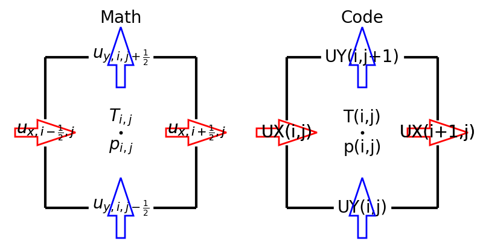
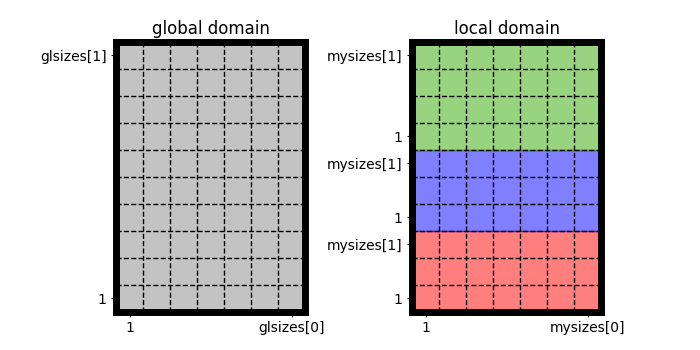

.. _domain_setup:

############
Domain Setup
############

.. include:: /references.txt

.. note::

    For simplicity, we omit the :math:`z` direction on this page.
    Practically, it is treated in the same manner as the :math:`y` direction.

***************************************
Staggered Grid and Domain Decomposition
***************************************

In this project, we utilize the staggered grid arrangement, i.e., all velocity components, pressure, and temperature are defined at different locations:

Here the left panel shows the locations and indices of the variables in the equations, while the right schematic describes notations used in the code.

We assume that the domain is wall-bounded in the :math:`x` direction, while periodic boundary conditions are imposed in the other directions.
The spatial resolution denotes the number of cell centers (where pressure and temperature are defined): e.g., ``glisize = domain->glsizes[0]`` and ``gljsize = domain->glsizes[1]`` in the :math:`x` and :math:`y` directions, respectively.

Note that the prefix **gl** is used to emphasize they are **global**.
This library supports process parallelization (in particular by means of ``Message Passing Interface: MPI``), splitting the whole domain into smaller blocks, and each process is only responsible for ``myisize x myjsize = domain->mysizes[0] x domain->mysizes[1]`` cell centers:

.. note::

    * No decomposition in the wall-normal direction

        In this project, the wall-normal direction is not decomposed, and we adopt the so-called `pencil decomposition <https://github.com/NaokiHori/SimpleDecomp>`_.
        Thus ``glisize = glsizes[0]`` and ``myisize = mysizes[0]`` are equal.

    * Pencil sizes can be different

        Although domains are decomposed such that each process has a similar workload, ``myjsize`` can be different for each process, especially when the domain size is not divisible by the number of processes in that direction.

For each process, variables are positioned as follows:

* ``UX(i, j)``

    .. image:: images/staggered2.png
        :width: 600
        :align: center

* ``UY(i, j)``

    .. image:: images/staggered3.png
        :width: 600
        :align: center

* ``P(i, j)`` and ``T(i, j)``

    .. image:: images/staggered4.png
        :width: 600
        :align: center

Notice the boundary treatments, where :math:`u_y, p, T` are exceptionally positioned to directly impose the wall boundary conditions.

Sizes of the two-dimensional arrays are as follows:

============ =============== ===============
Variable     ``i`` range     ``j`` range
============ =============== ===============
``UX``       ``1:myisize+1`` ``0:myjsize+1``
``UY``       ``0:myisize+1`` ``0:myjsize+1``
``P``, ``T`` ``0:myisize+1`` ``0:myjsize+1``
============ =============== ===============

.. note::

    * Cell-face positions and cell-center positions

        Cell centers are positioned in the middle of the two neighboring cell faces.

    * Halo cells

        To evaluate differentiations in the homogeneous directions at the domain boundaries, additional cells (halo cells) are appended in the :math:`y, z` directions.

***************************
Uniform and Stretched Grids
***************************

In the homogeneous directions, the distance between two neighboring points should be equal.
In the wall-normal direction, a non-uniform grid arrangement can be used, which could be beneficial to resolve boundary layers close to the walls (c.f., |VANDERPOEL2015|).
To identify this, two variables are defined in the ``domain`` structure.

#. Cell-face positions ``domain->xf``

    ``XF(i)`` is used to locate the wall-normal cell faces (**f** denotes face), i.e., where :math:`\ux` are defined.

    .. image:: images/grid1.png
        :width: 800
        :align: center

#. Cell-center positions ``domain->xc``

    ``XC(i)`` is used to locate the wall-normal cell centers (**c** denotes center), i.e., where :math:`p`, :math:`T`, and :math:`\uy` are defined.

    Note again that the first and the last points are exceptionally positioned at the boundaries.
    In the bulk, the following relation holds:

    .. math::

        XC \left( i \right)
        =
        \frac{1}{2} XF \left( i     \right)
        +
        \frac{1}{2} XF \left( i + 1 \right),

    i.e., the cell center is in the middle of the two neighboring cell faces.

    .. image:: images/grid2.png
        :width: 800
        :align: center

.. note::

    The cell-face and cell-center positions should be given along with a flow field to launch the simulator.

